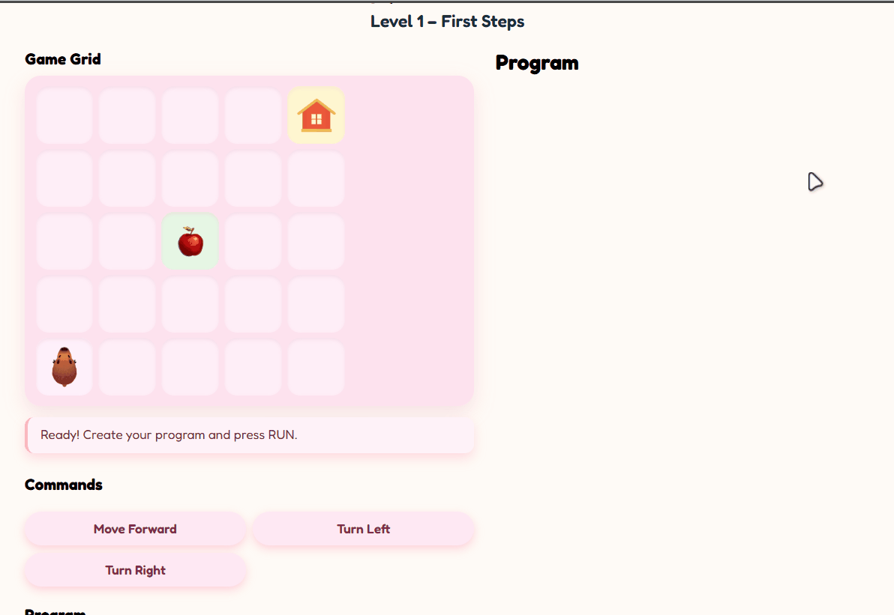

<div align="center">
  

  # 🐾 Capy Code Quest

  *A simple and interactive puzzle game to learn basic algorithms.*

  [](https://creativecommons.org/licenses/by-nc-sa/4.0/)
  [](#)
  [](#)
</div>

---

## 📖 About the Project

**Capy Code Quest** is an interactive educational game designed to introduce players to the fundamentals of programming logic and algorithms. The player must guide a capybara through a grid-based puzzle to collect apples and reach its home using a sequence of logical commands.

This project was developed as a Final Project for the **Technical English** course in the **TADS** (Tecnologia em Análise e Desenvolvimento de Sistemas) undergraduate program.

<div align="center">
  <i></i>
</div>

---

## ✨ Features

* **Algorithmic Thinking:** Learn basic programming concepts like sequential execution and loops (`repeatForward`).
* **Progressive Difficulty:** 10 unique levels introducing new mechanics gradually.
* **Puzzle Mechanics:** Obstacles (rocks), interactive switches, and lockable gates.
* **Multilingual Support (i18n):** Playable in English (EN), Spanish (ES), and Portuguese (PT), with dynamic UI updates.
* **Persistent Progress:** Uses `sessionStorage` to save completed levels locally without needing a database.
* **Responsive UI:** A cozy, pastel-themed interface built with CSS Grid and Flexbox.

---

## 🛠️ Technologies Used

This project was built entirely "from scratch" without relying on external game engines or heavy frameworks, focusing on core web technologies:

* **HTML5:** Semantic structure and layout.
* **CSS3:** Custom styling, CSS Grid for the game board, Flexbox for UI components, and playful UI/UX design.
* **Vanilla JavaScript (ES6+):** * Game loop execution (`setInterval`).
  * DOM Manipulation and event handling.
  * State management (Capy position, orientation, inventory).
  * Multilingual dictionary logic.

---

## 🎮 How to Play (Game Mechanics)

The goal of each level is to collect all apples and reach the goal house. You must "write a program" by clicking the command buttons, and then press **RUN** to execute them in order.

### 📜 Available Commands
* `moveForward`: Moves the capybara one cell in the direction it is facing.
* `turnLeft` / `turnRight`: Rotates the capybara 90 degrees.
* `repeatForward 2x` / `3x`: Introduces the concept of loops to save lines of code.

### 🧩 Grid Elements
* 🍎 **Apples:** Collectibles required to clear the level.
* 🪨 **Rocks:** Obstacles. Hitting them crashes the program.
* 🔘 **Switches:** Step on them to open gates.
* 🚪 **Gates:** Block the path until the corresponding switch is activated.
* 🏠 **House (Goal):** The final destination!

---

## 🚀 Running the Project Locally

Since the project uses Vanilla HTML/CSS/JS, running it is incredibly simple. No build steps (like `npm install` or `webpack`) are required.

1. Clone this repository:
   ```bash
   git clone [https://github.com/your-username/capy-code-quest.git](https://github.com/your-username/capy-code-quest.git)
